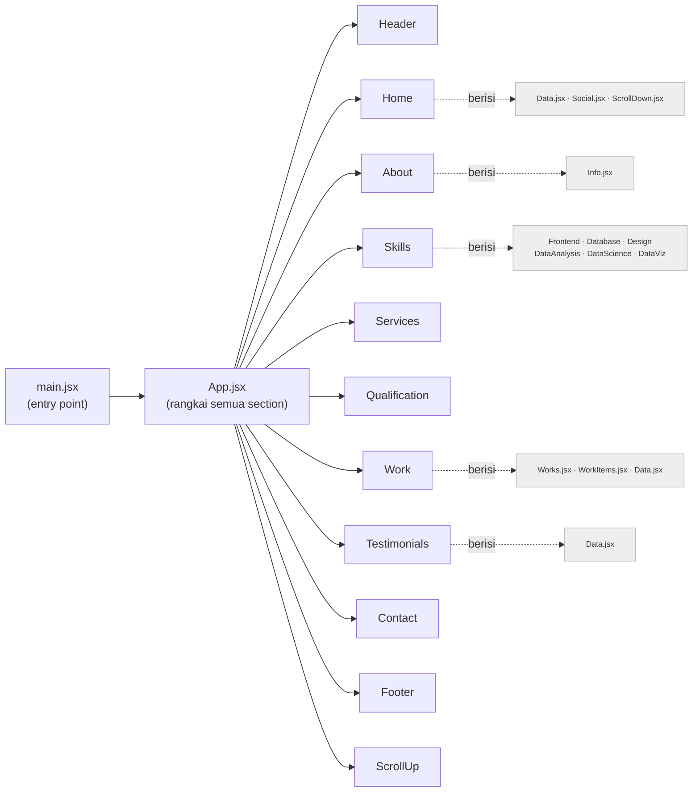

# Struktur Proyek

Peta cepat supaya langsung paham repo ini. Lihat juga [README.md](README.md) untuk peta konten & alur update.

## Pola inti (paham ini = paham semuanya)

Setiap **section halaman = satu folder** di `src/components/<nama>/`, berisi:

- `<Nama>.jsx` → tampilan & logika komponen
- `<nama>.css` → style khusus komponen itu
- `Data.jsx` (sebagian folder) → **data konten** (array projek, testimoni) dipisah dari tampilan
- sub-komponen bila perlu (mis. `WorkItems.jsx`, `Info.jsx`, `Social.jsx`)

Urutan komponen di `App.jsx` = urutan section dari atas ke bawah di web.

## Pohon render



## Mana yang punya data konten terpisah

Kalau mau ubah **isi/teks/daftar**, cari `Data.jsx` dulu; kalau mau ubah **tampilan**, edit `<Nama>.jsx`/`.css`.

| Section | File konten | Sub-komponen |
|---------|-------------|--------------|
| Home | `home/Data.jsx` | `Social.jsx`, `ScrollDown.jsx` |
| About | — | `Info.jsx` |
| Skills | — | 6 kartu skill (`Frontend.jsx`, `Database.jsx`, dst) |
| Work | `work/Data.jsx` | `Works.jsx`, `WorkItems.jsx` |
| Testimonials | `testimonials/Data.jsx` | — |
| Services, Qualification, Contact, Header, Footer, ScrollUp | — (langsung di `.jsx`) | — |

## Peta folder

```
src/
├── main.jsx            # entry — mount <App> ke #root
├── App.jsx             # susun semua section berurutan
├── index.css           # style global + variabel
├── App.css             # style layout utama
├── assets/             # gambar, ikon SVG, CV PDF
└── components/
    ├── header/         # navbar
    ├── home/           # hero + sosial + scroll indicator
    ├── about/          # tentang + info
    ├── skills/         # kumpulan kartu skill
    ├── services/       # layanan
    ├── qualification/  # pendidikan/pengalaman
    ├── work/           # portfolio projek (pakai Data.jsx)
    ├── testimonials/   # testimoni (pakai Data.jsx, slider Swiper)
    ├── contact/        # form kontak (EmailJS)
    ├── footer/         # footer
    └── scrollup/       # tombol scroll-to-top
```

## Aliran teknologi

- **React** merender komponen → **Vite** yang bundling & serve (dev) / build (produksi).
- **Swiper** dipakai untuk slider (testimoni).
- **EmailJS** menangani pengiriman form kontak tanpa backend.

> Diagram Mermaid tampil otomatis di GitHub & preview Markdown VSCode.
