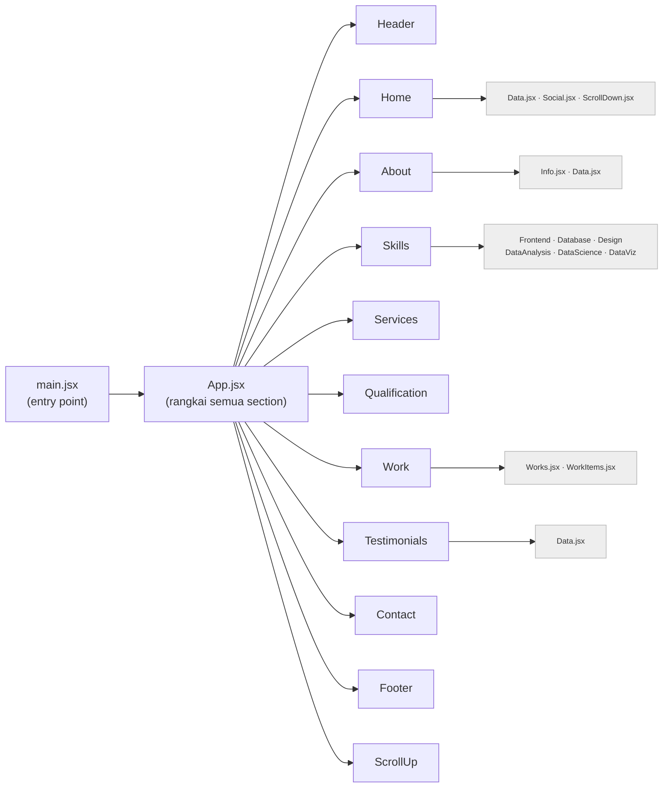
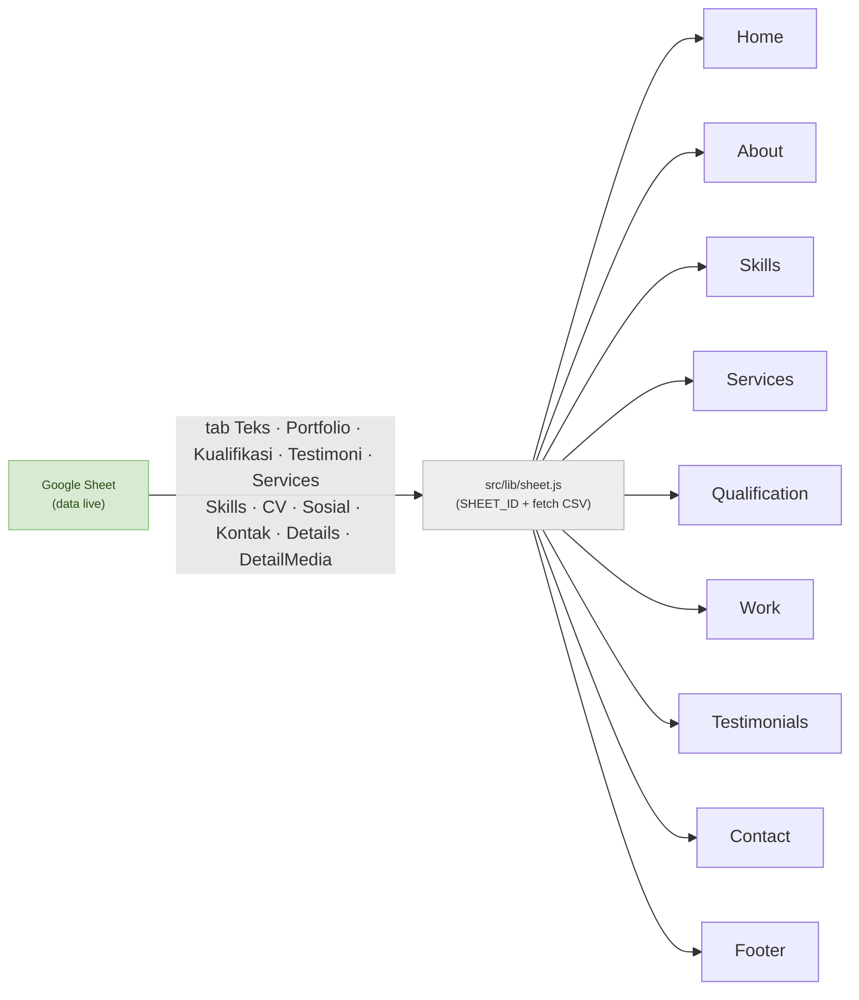

# Struktur Proyek

Peta cepat supaya langsung paham repo ini. Lihat juga [README.md](README.md) untuk peta konten & alur update.

## Pola inti (paham ini = paham semuanya)

Setiap **section halaman = satu folder** di `src/components/<nama>/`, berisi:

- `<Nama>.jsx` → tampilan & logika komponen
- `<nama>.css` → style khusus komponen itu
- `Data.jsx` (sebagian folder) → **data konten** (array projek, testimoni) dipisah dari tampilan
- sub-komponen bila perlu (mis. `WorkItems.jsx`, `Info.jsx`, `Social.jsx`)

Urutan komponen di `App.jsx` = urutan section dari atas ke bawah di web.

## Pohon render

Urutan node = urutan section di `App.jsx` = urutan tampil di halaman (atas ke bawah).



## Alur data (Google Sheet)

9 dari 11 section ambil konten dari Google Sheet lewat `src/lib/sheet.js` saat runtime;
kalau fetch gagal, tiap section jatuh ke `Data.jsx`/fallback bawaannya sendiri.



> Home & Footer berbagi tab `Sosial` lewat `src/lib/socials.jsx` (kolom `Lokasi`
> menentukan tampil di samping Home, di Footer, atau keduanya).
>
> Work & Qualification berbagi **modal "Details"** (`work/WorkDetail.jsx`): isinya
> dari tab `Details` + `DetailMedia` yang digabung per `Folder` di
> `work/details.jsx` (hook `useDetails`). Qualification menyambung lewat kolom
> `Folder` di tab `Kualifikasi`.

## Mana yang punya data konten terpisah

Kalau mau ubah **isi/teks/daftar**, cari `Data.jsx` dulu; kalau mau ubah **tampilan**, edit `<Nama>.jsx`/`.css`.

| Section | File konten | Sub-komponen |
|---------|-------------|--------------|
| Home | **Sheet tab `Teks`** (subjudul & deskripsi) via `lib/texts.js` + **Sheet tab `Sosial`** (ikon sosial samping) via `lib/socials.jsx` | `Data.jsx`, `Social.jsx`, `ScrollDown.jsx` |
| About | **Sheet tab `Teks`** (deskripsi & info box) via `lib/texts.js` + **Sheet tab `CV`** (link CV aktif) via `about/Data.jsx` | `Info.jsx`, `Data.jsx` |
| Skills | **Sheet tab `Skills`** + `skills/Data.jsx` (fallback & urutan kategori); ikon di `icons.jsx` | 6 kartu skill (`Frontend.jsx`, `Database.jsx`, dst) |
| Services | **Sheet tab `Services`** + `services/Data.jsx` (fallback) | — |
| Qualification | **Sheet tab `Kualifikasi`** + `qualification/Data.jsx` (fallback); kolom `Folder` menyambung ke modal Details (`work/details.jsx`) | — |
| Work | **Sheet tab `Portfolio`** + `work/Data.jsx` (fallback); modal Details dari **Sheet tab `Details` + `DetailMedia`** via `work/details.jsx` (`useDetails`), fallback `projectDetails` | `Works.jsx`, `WorkItems.jsx`, `WorkDetail.jsx` |
| Testimonials | **Sheet tab `Testimoni`** + `testimonials/Data.jsx` (fallback) | — |
| Contact | **Sheet tab `Kontak`** (kartu "Talk to me") + `contact/Data.jsx` (fallback); form kirim pesan EmailJS tetap di `Contact.jsx` | — |
| Footer | **Sheet tab `Sosial`** (ikon sosial, filter footer) via `lib/socials.jsx`; judul/nav/copyright hardcoded | — |
| Header, ScrollUp | — (langsung di `.jsx`) | — |

Konfigurasi `SHEET_ID`, parser CSV, dan hook `useSheetList` dipakai bersama di
`src/lib/sheet.js`; teks tunggal (kunci–nilai) lewat `src/lib/texts.js`; ikon sosial
(font-icon vs gambar) + tab `Sosial` lewat `src/lib/socials.jsx`.

## Peta folder

```
public/
├── portfolio/          # gambar Portfolio, 1 folder per proyek: <slug>/cover.jpg (+ galeri Details)
├── testimonials/       # foto testimoni (dirujuk kolom Foto di Sheet tab Testimoni)
└── social/             # ikon sosial custom .svg (Tableau/Kaggle/RPubs/X) — dirujuk kolom Ikon di Sheet tab Sosial/Kontak
src/
├── main.jsx            # entry — mount <App> ke #root
├── App.jsx             # susun semua section berurutan
├── index.css           # style global + variabel
├── App.css             # style layout utama
├── assets/             # gambar, ikon SVG
├── lib/
│   ├── sheet.js        # SHEET_ID + fetch/parser CSV + hook useSheetList (dipakai semua section)
│   ├── texts.js        # tab "Teks" (kunci–nilai) + teks cadangan
│   ├── socials.jsx     # tab "Sosial" + renderer ikon (font vs gambar) — dipakai Home & Footer
│   └── socials.css     # style ikon sosial berbasis gambar (mask, ikut warna)
└── components/
    ├── header/         # navbar
    ├── home/           # hero + sosial (Sheet tab Sosial) + scroll indicator
    ├── about/          # tentang + info + link CV aktif (Sheet tab CV)
    ├── skills/         # kumpulan kartu skill
    ├── services/       # layanan
    ├── qualification/  # pendidikan/pengalaman
    ├── work/           # portfolio projek (data dari Google Sheet; gambar di public/portfolio/)
    ├── testimonials/   # testimoni (pakai Data.jsx, slider Swiper)
    ├── contact/        # kartu "Talk to me" (Sheet tab Kontak, Data.jsx) + form kirim pesan (EmailJS)
    ├── footer/         # footer (ikon sosial dari Sheet tab Sosial)
    └── scrollup/       # tombol scroll-to-top
```

## Aliran teknologi

- **React** merender komponen → **Vite** yang bundling & serve (dev) / build (produksi).
- **Swiper** dipakai untuk slider (testimoni).
- **EmailJS** menangani pengiriman form kontak tanpa backend.
- **Google Sheet** jadi sumber konten teks: satu spreadsheet dengan tab `Portfolio`,
  `Teks`, `Kualifikasi`, `Testimoni`, `Services`, `Skills`, `CV`, `Sosial`, `Kontak`,
  `Details`, `DetailMedia`. Tiap section men-`fetch` CSV tab-nya saat runtime lewat
  `src/lib/sheet.js` (difilter `Tampilkan`/`Aktif`, diurutkan `Urutan` kalau ada); kalau
  gagal/ID kosong, jatuh ke data cadangan di kode supaya tak pernah blank. Tab `Details` +
  `DetailMedia` digabung per `Folder` (join, bukan section sendiri) untuk mengisi modal Details.

> Diagram Mermaid tampil otomatis di GitHub & preview Markdown VSCode.
